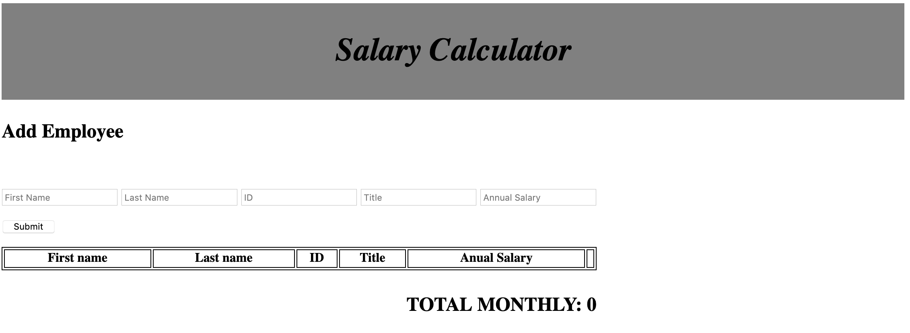

# jQuery Salary Calculator

## Description

Calculates employee salaries.

## Screen Shot

### Prerequisites

- Web browser

## Installation

1. Clone the project

## Usage

1. Open index.html
2. Fill the form and click submit.

## Built With

- JQuery

## Acknowledgement
Thanks to [Prime Digital Academy](www.primeacademy.io) who equipped and helped me to make this application a reality.

## Support
If you have suggestions or issues, please email me at karla.d.fish@gmail.com.
